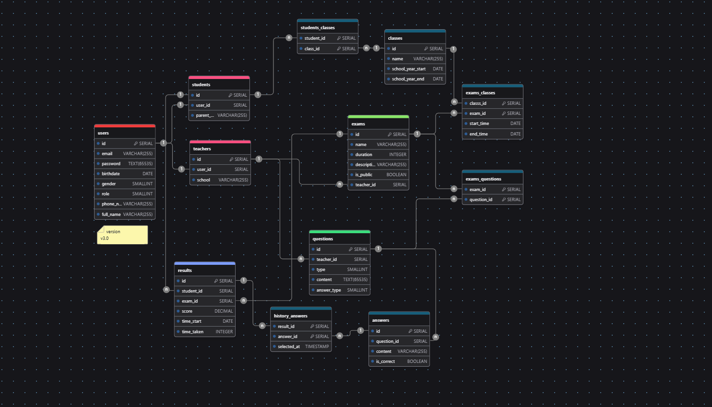

# Online Multiple-Choice Exam System

## Overview

The system is designed to assist high school teachers in organizing exams and assessments to evaluate students' abilities. It provides statistical data on tests, tracks the number of participants, and manages and stores test results.

### Version

**v3.0**

### Author

**Full-name:** Mai Đăng Huân  
**Position:** BE Developer - Intern

## Purpose

This system is designed for high school teachers to create, organize, and manage exams. It includes functionalities for creating multiple-choice tests, viewing results, and providing statistical analysis.

### Main Actors

1. **Administrators:**
    - Create accounts for teachers and students.
    - Send login information via email.

2. **Teachers:**
    - Create multiple-choice tests.
    - View student results.

3. **Students:**
    - Participate in tests.
    - Practice and review knowledge with mock tests.

## Functional Analysis

### Actors & Functions

| Actors        | Common Functions                                   | Specific Functions                           |
|---------------|---------------------------------------------------|----------------------------------------------|
| Administrators| - Login/Logout - Manage Personal Information    | - Manage Users - Manage Exams - View All Exam Results|
| Teachers      | - Manage Classes - Manage Exams                 | - View Their Exam Results - Save their questions in storage                   |
| Students      | - Search and View Classes - Search and View Exams | - Take Exam - View Results               |

## Database Design

### Entity-Relationship Diagram (ERD) (v3.0)

  

### Database Tables Description

...updating

## Notes

- Ensure that the image file paths are updated correctly when adding the ERD diagram.
- Database descriptions provide an overview of the data structure.

## References

Describe any additional references or resources here.

## Import db on [link](https://drawdb.vercel.app/editor)

1. Click link https://drawdb.vercel.app/editor
2. Download *.ddb
3. Choose option `File > Import Diagram` or `Ctrl + I`
4. Drag and drop *.ddb and click `Import` button

## DB exercises [./exercises](./exercises)